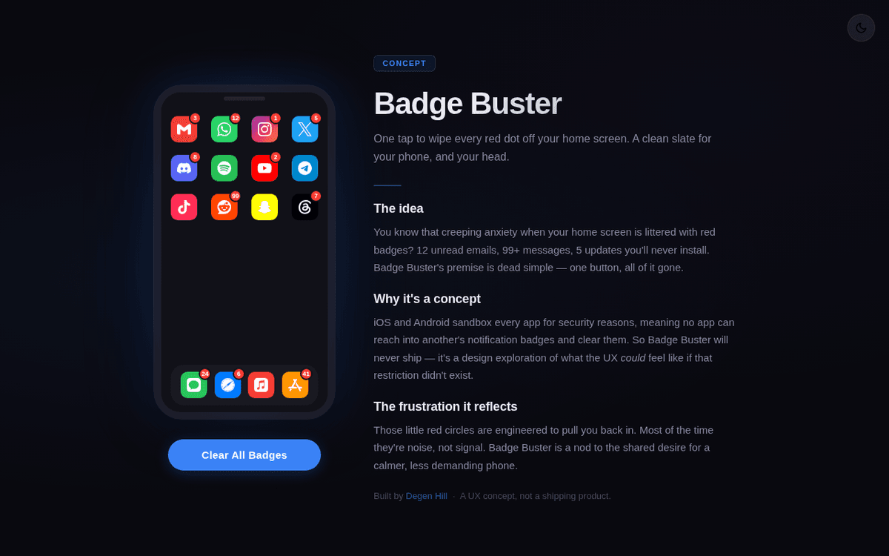

# Badge Buster

A UX concept exploring the idea of clearing every notification badge on your phone with a single tap.



## What is this?

Badge Buster is a design concept, not a shipping product. iOS and Android sandbox apps for security and privacy, so no app can actually reach into other apps and clear their badges. This project visualizes what that experience *could* feel like if that restriction didn't exist.

## Live Demo

[badge-buster.vercel.app](https://badge-buster.vercel.app)

## Why?

Badge fatigue is real. Those little red circles are engineered to pull you back into apps, and most of the time they're noise. This is a nod to the shared desire for a calmer phone experience.

## Stack

Deliberately minimal — this is a single static HTML file with inline CSS and vanilla JS. No build step, no framework, no dependencies:

- App icons pulled live from the [Simple Icons](https://simpleicons.org) CDN
- Dark/light theme toggle using the [View Transitions API](https://developer.mozilla.org/en-US/docs/Web/API/View_Transitions_API) for the circular reveal animation
- [Vercel Analytics](https://vercel.com/analytics) for pageview tracking
- Deployed on Vercel as a static site

## Running Locally

It's a single HTML file. Open `index.html` in your browser or serve it however you want:

```bash
npx serve .
```

## History

Badge Buster started as an Expo/React Native app prototype before being rebuilt as this static concept page — the current `main` branch reflects that rebuild.

## License

MIT — see [`LICENSE`](LICENSE).
